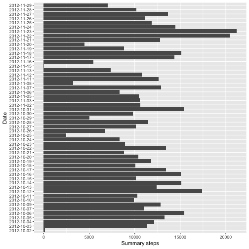
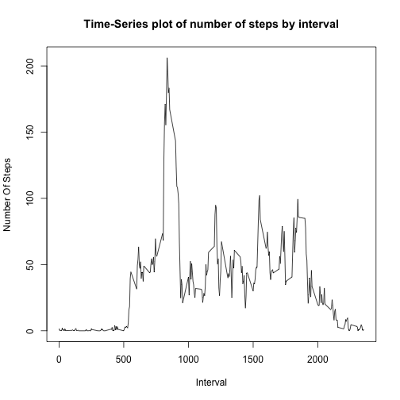
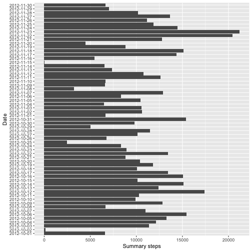
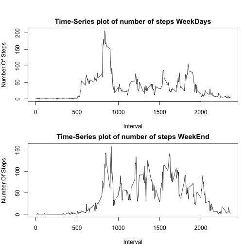

# Course Project 1
This assignment makes use of data from a personal activity monitoring device. This device collects data at 5 minute intervals through out the day. The data consists of two months of data from an anonymous individual collected during the months of October and November, 2012 and include the number of steps taken in 5 minute intervals each day.

The variables included in this dataset are:

* steps: Number of steps taking in a 5-minute interval (missing values are coded as NA)
* date: The date on which the measurement was taken in YYYY-MM-DD format
* interval: Identifier for the 5-minute interval in which measurement was taken
  
First of all we need to connect libraries that we will use in our analisys(Here i hide output of importing, because of useless warnings):

```r
library(dplyr)
library(ggplot2)
```
1. Assuming that file in our working directory:

```r
data<-read.csv("activity.csv")
```

Lets See some summary on data:

```r
head(data)
```

```
##   steps       date interval
## 1    NA 2012-10-01        0
## 2    NA 2012-10-01        5
## 3    NA 2012-10-01       10
## 4    NA 2012-10-01       15
## 5    NA 2012-10-01       20
## 6    NA 2012-10-01       25
```

```r
tail(data)
```

```
##       steps       date interval
## 17563    NA 2012-11-30     2330
## 17564    NA 2012-11-30     2335
## 17565    NA 2012-11-30     2340
## 17566    NA 2012-11-30     2345
## 17567    NA 2012-11-30     2350
## 17568    NA 2012-11-30     2355
```

```r
str(data)
```

```
## 'data.frame':	17568 obs. of  3 variables:
##  $ steps   : int  NA NA NA NA NA NA NA NA NA NA ...
##  $ date    : Factor w/ 61 levels "2012-10-01","2012-10-02",..: 1 1 1 1 1 1 1 1 1 1 ...
##  $ interval: int  0 5 10 15 20 25 30 35 40 45 ...
```

```r
sum(is.na(data$steps))
```

```
## [1] 2304
```
Last row is number of NA Values in steps column  
Let's group by date and summarize steps to build a histogram

```r
summarized<-data%>%group_by(date)%>%na.omit()%>%summarise(sum(steps))
ggplot(summarized, aes(date,`sum(steps)`))+geom_bar(stat = "identity")+coord_flip()+labs(y = "Summary steps", x = "Date")
```




2. For building this Histogram, i'm inverted the axies, because otherwise, the dates on X-Axis will be unreadable

3. For the calculation of mean and median steps taken each day we may use the grouped and summarized data from previous quastion


```r
mean(summarized$`sum(steps)`)
```

```
## [1] 10766.19
```

```r
median(summarized$`sum(steps)`)
```

```
## [1] 10765
```
4. Building a Time-Series plot of average steps taken by day  
For that we use aggregate function first, to average steps on interval, then build time-series plot, and find max value

```r
Time_series<-aggregate(data$steps,list(interval = data$interval),mean, na.rm = TRUE)
with(Time_series,plot(interval,x,type = "l",main = "Time-Series plot of number of steps by interval",xlab = "Interval",ylab = "Number Of Steps"))
```



5. For Finding maximum interval we could use simpe command which.max, since we interested only in interval, we could return only 1st element of this row

```r
Time_series[which.max(Time_series$x),][1]
```

```
##     interval
## 104      835
```

6. First of all let's find out how much Nan values we have in our dataframe

```r
sum(is.na(data$steps))
```

```
## [1] 2304
```
Nearly two and a half thousands of 17k observations which is 13%, pretty big value  
For inmputing values instead of Na lets return to our Time-Series graph, as we see, at first 500 intervals its almost no steps, it can mean that people sleep in that time, so i think it would be better to input 0 in this intervals on each day  
For that lets select NaN's in prefered interval, than replace values with 0

```r
sel<-which(data$interval<=500)
data$steps[sel][is.na(data$steps[sel])]<-0
```

Our Next Step is to replace all other Nans, i think it would be better to replace with mean steps per day plus some random number, but with upper limit(to omit situatins, where number of steps will be too big) In other words, we randomize, but little smarter:)  


```r
Mean<-data%>%group_by(Date = date)%>%na.omit()%>%summarize(Mean = round(mean(steps)))
data$steps<-ifelse(match(Mean$Date,data$date)&is.na(data$steps),sample(Mean$Date,replace = TRUE),data$steps)
```

After that we neeed to recalculate summarized for our filled data frame:

```r
summarized_fill<-data%>%group_by(date)%>%summarise(sum(steps))
```
And build new histogram:

```r
ggplot(summarized_fill, aes(date,`sum(steps)`))+geom_bar(stat = "identity")+coord_flip()+labs(y = "Summary steps", x = "Date")
```



After that lets recalculate new mean and median

```r
mean(summarized_fill$`sum(steps)`)
```

```
## [1] 10220.59
```

```r
median(summarized_fill$`sum(steps)`)
```

```
## [1] 10395
```
As wee see, mean and median number of steps change, it became smaller, may be because of changing some part of NaNs with zeroes

7. For the next part of the assaiment we need to check out which days are weekdays and which is weekends. For that we create vector, that give us all the names of weekdays in our DataFrame


```r
data_weekday<-weekdays(as.Date(data$date,"%Y-%m-%d"))
```

```
## Warning in strptime(x, format, tz = "GMT"): unknown timezone 'zone/tz/
## 2017c.1.0/zoneinfo/Europe/Moscow'
```
After that we can easily create Factor Variable with two levels based on separation:

```r
data$weekday<-as.factor(ifelse(data_weekday=="Saturday"|data_weekday=="Sunday", "weekend","weekday"))
```

Then we need to separetly aggregate our dataset depends on weekday:

```r
TS_Weekday<-aggregate(steps~interval,data = subset(data,weekday == "weekday"),mean)
TS_Weekend<-aggregate(steps~interval,data = subset(data,weekday == "weekend"),mean)
```

After that we need to plot the graphs with base plotting system, cause in my opinion they more representative in this case

```r
par(mfrow = c(2,1),mar = c(4,4,2,1),oma = c(0,0,2,0))
with(TS_Weekday,plot(interval,steps,type = "l",main = "Time-Series plot of number of steps WeekDays",xlab = "Interval",ylab = "Number Of Steps"))
with(TS_Weekend,plot(interval,steps,type = "l",main = "Time-Series plot of number of steps WeekEnd",xlab = "Interval",ylab = "Number Of Steps"))
```


